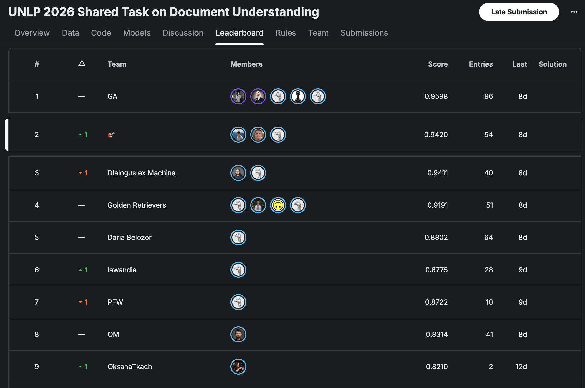

# UNLP 2026: Team 🎯 solution

The repository includes the solution to the [UNLP-2026 shared task](https://github.com/unlp-workshop/unlp-2026-shared-task).

## Authors

Our team consists of 3 extremely talanted engineers:

- [Mykola Trokhymovych](https://www.linkedin.com/in/trokhymovych/)
- [Yana Oliinyk](https://www.linkedin.com/in/yana-oliinyk-58a72317b/)
- [Nazarii Nyzhnyk](https://www.linkedin.com/in/nazariinyzhnyk/)

Connect on LinkedIn, we are friendly! 😉

## Our results 🥈

With all the efforts combined we got second place in this competition!

Kaggle competition is private, but here is a head of a private leaderboard:



## Steps to reproduce results

Success story (replication of results) consists of the following steps:

- get the data from shared task [repo](https://github.com/unlp-workshop/unlp-2026-shared-task)
- launch synthetic data generation to extend question set
- finetune (PEFT) LLM to get from a general-purpose LLM to a task specific model
- run retrieval and generation .ipynb notebook
- profit 🤑

### Synthetic question generation pipeline

Question generation pipeline is located here: [modules/generate_questions.py](modules/generate_questions.py)

### LLM finetuning pipeline

LLM finetuning script is here: [modules/model_finetuning.py](modules/model_finetuning.py)

### Kaggle competition file

Final kaggle submission notebook with all the steps needed for inference may be found here: [submission-pipeline.ipynb](submission-pipeline.ipynb).

## Building wheels for kaggle example

Since internet usage in kaggle pipeline was disabled and there is a need to install packages beyond default ones, you may need to download packages with deps as binaries and load them to kaggle as datasets.

Bash command to download necessary package along with its dependencies:

```bash
uv run pip download tantivy==0.25.1 \
  --only-binary=:all: \
  --platform manylinux2014_aarch64 \
  --python-version 3.12 \
  --implementation cp \
  --abi cp312 \
  -d wheels
```
